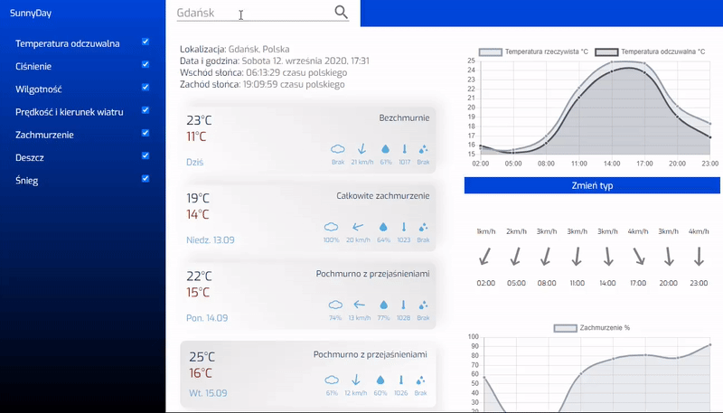
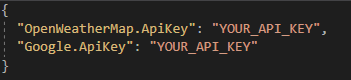
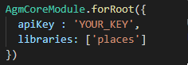

# WeatherApp

An application that performs the following functions: 

1.	Shows weather forecast for the next 5 days including:

-	Minimum temperature
-	Maximum temperature
-	Humidity 
-	Wind speed
-	Wind direction
-	Rain and Snow
-	Pressure

2.	Finds every place on earth thanks to the Open Weather Map API.
3.	Auto-complete search form when entering place thanks to the Google Autocomplete API.
4.	Allows to choose data that interests you.
5.	Two types of animated charts.
6.	Shows current date, time and time of sunrise and sunset.

## Technologies and API’s:

1.	ASP.NET Core 3.1 Web API
2.	Angular 9
3.	Google Autocomplete API
4.	Open Weather Map API
5.	Ng2-Charts

## First run

1. Before fisrt run you have to save Open Weather Map API and Google API keys in secrets file of ASP.NET Web API project like below:

2. Next go to app.module.ts file in Angular client project (placed in clientApp directory) and replace Google Autocomplete API key like below:

3. Run server and client projects separately. Use `npm start` command to run Angular app.